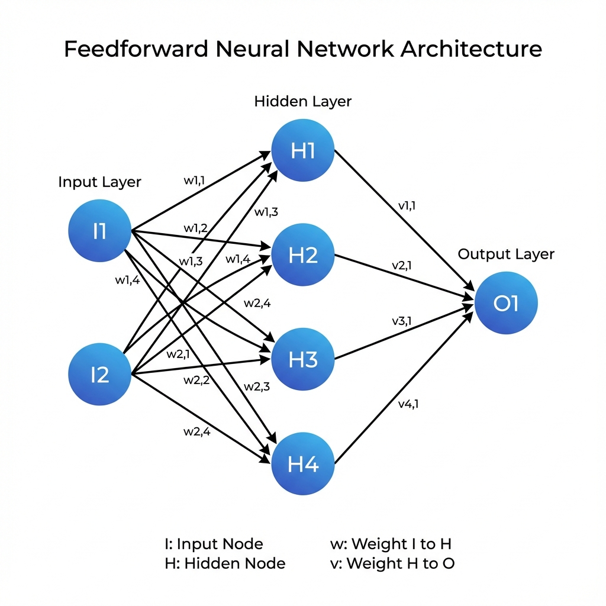
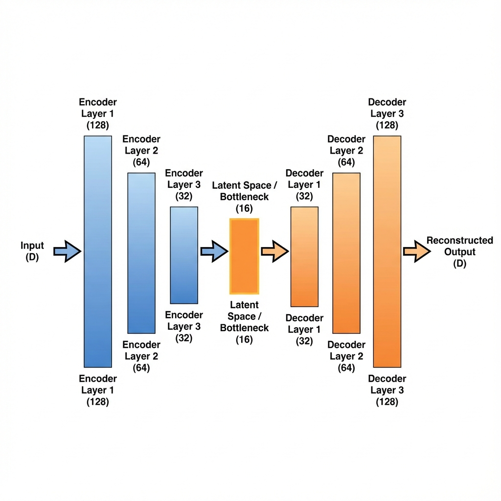

# 🎓 Complete Python Bootcamp: LangChain & Deep Learning

[](https://choosealicense.com/licenses/mit/)
[](https://www.python.org/downloads/)
[](https://pytorch.org/)

**A comprehensive curriculum covering 45 sections of modern machine learning and deep learning**

[📚 Course Overview](#-course-overview) • [🗂️ Curriculum](#️-curriculum-sections) • [📊 Statistics](#-course-statistics) • [📄 License](#-license)

---

## 📚 Course Overview

This comprehensive bootcamp takes you from Python fundamentals to advanced deep learning architectures. Master neural networks, CNNs, RNNs, Transformers, and cutting-edge generative models through hands-on implementation with PyTorch and TensorFlow.

### 🎯 What You'll Learn

- **Foundations**: Python programming, data preprocessing, and classical ML
- **Neural Networks**: Feedforward networks, backpropagation, optimizers
- **Computer Vision**: CNNs, image classification, neural style transfer
- **Sequential Models**: RNNs, LSTMs, bidirectional networks
- **Generative AI**: Autoencoders, VAE, GANs, DCGAN
- **Transformers**: Attention mechanism, BERT, GPT, Vision Transformers
- **Unsupervised Learning**: Clustering, dimensionality reduction

---

## 🎨 Visual Diagrams

Below are the key architecture diagrams covered in this course:

<details>
<summary><b>Click to view all diagrams</b></summary>

### Neural Network Architecture

<p><i>Basic feedforward neural network structure</i></p>

### Activation Functions

<p><i>ReLU, Sigmoid, and Tanh comparison</i></p>

### Backpropagation Flow

<p><i>Forward and backward pass visualization</i></p>

### CNN Architecture

<p><i>Convolutional neural network structure</i></p>

### LSTM Structure

<p><i>Long Short-Term Memory cell architecture</i></p>

### Autoencoder Architecture

<p><i>Encoder-decoder structure with latent space</i></p>

</details>

---

## 🗂️ Curriculum Sections

### 📖 [Phase 1: Foundations](#phase-1-foundations-1)
### 🧠 [Phase 2: Neural Network Fundamentals](#phase-2-neural-network-fundamentals-1)
### ⚙️ [Phase 3: Deep Learning Frameworks](#phase-3-deep-learning-frameworks-1)
### 🖼️ [Phase 4: Convolutional Neural Networks](#phase-4-convolutional-neural-networks-1)
### 🔄 [Phase 5: Sequential Models (RNN & LSTM)](#phase-5-sequential-models-rnn--lstm-1)
### 🚀 [Phase 6: Advanced Architectures & Generative Models](#phase-6-advanced-architectures--generative-models-1)
### 🤖 [Phase 7: Transformers & NLP](#phase-7-transformers--nlp-1)
### 🎨 [Phase 8: Other Advanced Topics](#phase-8-other-advanced-topics-1)

---

## Phase 1: Foundations

<details>
<summary><b>Section 1: Introduction of the Course and Course Material</b> (12min • 0/3 lessons) 📖</summary>

Introduction to the course structure, learning objectives, and available resources.
</details>

<details>
<summary><b>Section 2: Introduction to Google Colab</b> (35min • 1/5 lessons) 📁 <a href="./1_Section_02_Google_Colab/">Folder</a></summary>

Learn how to use Google Colab for running Python notebooks in the cloud, including GPU acceleration.
</details>

<details>
<summary><b>Section 3: Python Crash Course</b> (5hr 51min • 0/36 lessons) 📁 <a href="./1_Section_03_Python_Crash_Course/">Folder</a></summary>

Comprehensive Python fundamentals covering:
- Data types and variables
- Control structures (if/else, loops)
- Functions and lambda expressions
- Object-oriented programming
- File I/O operations
</details>

<details>
<summary><b>Section 4: Pre-requisites Sections</b> (2min • 1/1 lesson) 📖</summary>

Overview of prerequisite knowledge required for the course.
</details>

<details>
<summary><b>Section 5: Pre-requisite: Data Preprocessing</b> (1hr 40min • 11/11 lessons) 📁 <a href="./1_Section_05_Data_Preprocessing/">Folder</a></summary>

Essential data preprocessing techniques:
- Data cleaning and handling missing values
- Feature scaling and normalization
- Encoding categorical variables
- Train-test split strategies
</details>

<details>
<summary><b>Section 6: Pre-requisite: Regression Analysis</b> (5hr 29min • 19/34 lessons) 📁 <a href="./1_Section_06_Regression_Analysis/">Folder</a></summary>

Comprehensive coverage of regression techniques:
- Linear Regression
- Polynomial Regression
- Ridge and Lasso Regression
- Model evaluation metrics (MSE, RMSE, R²)
</details>

<details>
<summary><b>Section 7: Pre-requisite: Logistic Regression</b> (2hr 55min • 1/17 lessons) 📁 <a href="./1_Section_07_Logistic_Regression/">Folder</a></summary>

Binary and multiclass classification using logistic regression, including decision boundaries and evaluation metrics.
</details>

[🔝 Back to top](#-complete-python-bootcamp-langchain--deep-learning)

---

## Phase 2: Neural Network Fundamentals

<details>
<summary><b>Section 8: Introduction to Neural Networks and Deep Learning</b> (42min • 5/5 lessons) 📖</summary>


Core concepts of neural networks:
- **Perceptrons** and Multi-layer Perceptrons
- **Forward propagation** algorithm
- **Weight initialization** strategies
- **Universal approximation** theorem
</details>

<details>
<summary><b>Section 9: Activation Functions</b> (48min • 4/8 lessons) 📖</summary>


Deep dive into activation functions:
- **ReLU** (Rectified Linear Unit) - most common
- **Sigmoid** - for binary classification
- **Tanh** - for normalized outputs
- **Leaky ReLU** and **ELU** variants
- **Softmax** - for multi-class problems
</details>

<details>
<summary><b>Section 10: Loss Function</b> (25min • 3/4 lessons) 📖</summary>

Understanding loss functions for different tasks:
- **Mean Squared Error (MSE)** - regression tasks
- **Binary Cross-Entropy** - binary classification
- **Categorical Cross-Entropy** - multi-class classification
- **Sparse Categorical Cross-Entropy**
</details>

<details>
<summary><b>Section 11: Back Propagation</b> (39min • 2/4 lessons) 📖</summary>


Mathematical foundations of backpropagation:
- **Chain rule** application
- **Gradient computation** through layers
- **Computational graphs**
- **Vanishing and exploding gradients** problem
</details>

<details>
<summary><b>Section 12: Optimizers</b> (33min • 5/7 lessons) 📖</summary>

Advanced optimization algorithms:
- **SGD** (Stochastic Gradient Descent)
- **Momentum** and **Nesterov Momentum**
- **AdaGrad** and **RMSprop**
- **Adam** and **AdamW** (most popular)
- Learning rate schedules
</details>

[🔝 Back to top](#-complete-python-bootcamp-langchain--deep-learning)

---

## Phase 3: Deep Learning Frameworks

<details>
<summary><b>Section 13: Neural Networks for Regression with PyTorch</b> (1hr 3min • 3/5 lessons) 📁 <a href="./3_Section_13_NN_Regression_PyTorch/">Folder</a></summary>

Building regression models using PyTorch:
- Dataset and DataLoader
- Model architecture design
- Training loops
- Validation and testing
</details>

<details>
<summary><b>Section 14: Neural Networks for Regression with TensorFlow</b> (36min • 2/3 lessons) 📁 <a href="./3_Section_14_NN_Regression_TensorFlow/">Folder</a></summary>

Implementing regression with TensorFlow/Keras:
- Sequential and Functional API
- Custom layers and models
- Callbacks and model checkpointing
</details>

<details>
<summary><b>Section 15: Neural Network for Classification with PyTorch</b> (2hr 35min • 0/14 lessons) 📁 <a href="./3_Section_15_NN_Classification_PyTorch/">Folder</a></summary>

Classification tasks using PyTorch:
- Binary and multi-class classification
- Softmax activation
- Cross-entropy loss
- Evaluation metrics (accuracy, precision, recall, F1)
</details>

<details>
<summary><b>Section 16: Neural Network for Classification with TensorFlow</b> (46min • 0/4 lessons) 📁 <a href="./3_Section_16_NN_Classification_TensorFlow/">Folder</a></summary>

TensorFlow implementation for classification problems with model evaluation and confusion matrices.
</details>

<details>
<summary><b>Section 17: Dropout Regularization and Batch Normalization</b> (1hr 40min • 4/8 lessons) 📁 <a href="./3_Section_17_Dropout_Batch_Normalization/">Folder</a></summary>

Regularization techniques to prevent overfitting:
- **Dropout** layers and dropout rate tuning
- **Batch Normalization** for training stability
- **Layer Normalization**
- L1 and L2 regularization
</details>

<details>
<summary><b>Section 18: Creating Custom Loss Function</b> (15min • 2/3 lessons) 📁 <a href="./3_Section_18_Custom_Loss_Function/">Folder</a></summary>

Designing custom loss functions for specific use cases in both PyTorch and TensorFlow.
</details>

<details>
<summary><b>Section 19: Scheduling Learning Rate</b> (23min • 1/3 lessons) 📁 <a href="./3_Section_19_Scheduling_Learning_Rate/">Folder</a></summary>

Learning rate scheduling strategies:
- Step decay
- Exponential decay
- Cosine annealing
- Reduce on plateau
</details>

<details>
<summary><b>Section 20: Creating Custom Layer</b> (14min • 2/3 lessons) 📁 <a href="./3_Section_20_Custom_Layer/">Folder</a></summary>

Building custom neural network layers with learnable parameters.
</details>

[🔝 Back to top](#-complete-python-bootcamp-langchain--deep-learning)

---

## Phase 4: Convolutional Neural Networks

<details>
<summary><b>Section 21: Convolutional Neural Network with PyTorch</b> (2hr 14min • 14/14 lessons) 📁 <a href="./4_Section_21_CNN_PyTorch/">Folder</a></summary>


Complete CNN implementation:
- **Convolutional layers** with filters/kernels
- **Pooling layers** (Max, Average)
- **Padding and stride** configurations
- **Feature map** visualization
- Image classification tasks
</details>

<details>
<summary><b>Section 22: Convolutional Neural Network with TensorFlow</b> (32min • 1/4 lessons) 📁 <a href="./4_Section_22_CNN_TensorFlow/">Folder</a></summary>


TensorFlow/Keras CNN implementation with data augmentation techniques.
</details>

<details>
<summary><b>Section 23: Setting Early Stopping Criterion</b> (29min • 5/5 lessons) 📁 <a href="./4_Section_23_Early_Stopping/">Folder</a></summary>

Implementing early stopping to prevent overfitting:
- Validation monitoring
- Patience parameter
- Model checkpointing
- Restoring best weights
</details>

[🔝 Back to top](#-complete-python-bootcamp-langchain--deep-learning)

---

## Phase 5: Sequential Models (RNN & LSTM)

<details>
<summary><b>Section 24: Recurrent Neural Networks (RNN) with PyTorch</b> (2hr 34min • 6/14 lessons) 📁 <a href="./5_Section_24_RNN_PyTorch/">Folder</a></summary>

RNN fundamentals for sequence data:
- Time series prediction
- Sequence-to-sequence models
- Handling variable-length sequences
- Hidden state management
</details>

<details>
<summary><b>Section 25: LSTM with TensorFlow</b> (1hr 20min • 0/9 lessons) 📁 <a href="./5_Section_25_LSTM_TensorFlow/">Folder</a></summary>


Long Short-Term Memory networks:
- **Forget gate** - selective memory
- **Input gate** - new information
- **Output gate** - hidden state
- **Cell state** - long-term dependencies
- Solving vanishing gradient problem
</details>

<details>
<summary><b>Section 26: Bidirectional LSTM with TensorFlow</b> (37min • 0/6 lessons) 📁 <a href="./5_Section_26_Bidirectional_LSTM_TensorFlow/">Folder</a></summary>


Bidirectional LSTM for processing sequences in both directions.
</details>

<details>
<summary><b>Section 27: Bidirectional LSTM with PyTorch</b> (27min • 0/3 lessons) 📁 <a href="./5_Section_27_Bidirectional_LSTM_PyTorch/">Folder</a></summary>


PyTorch implementation of bidirectional LSTM networks.
</details>

[🔝 Back to top](#-complete-python-bootcamp-langchain--deep-learning)

---

## Phase 6: Advanced Architectures & Generative Models

<details>
<summary><b>Section 28: One Dimensional (1D) CNN with PyTorch</b> (36min • 0/4 lessons) 📁 <a href="./6_Section_28_1D_CNN_PyTorch/">Folder</a></summary>

1D CNNs for time series and sequence data:
- Temporal pattern recognition
- Text classification
- Signal processing
</details>

<details>
<summary><b>Section 29: One Dimensional (1D) CNN with TensorFlow</b> (24min • 0/3 lessons) 📁 <a href="./6_Section_29_1D_CNN_TensorFlow/">Folder</a></summary>

TensorFlow implementation of 1D convolutional networks.
</details>

<details>
<summary><b>Section 30: Autoencoders</b> (53min • 4/6 lessons) 📁 <a href="./6_Section_30_Autoencoders/">Folder</a></summary>


Unsupervised learning with autoencoders:
- **Encoder** - dimensionality reduction
- **Latent space** - compressed representation
- **Decoder** - reconstruction
- Applications: denoising, anomaly detection
- Compression and feature learning
</details>

<details>
<summary><b>Section 31: CNN Autoencoder</b> (23min • 0/3 lessons) 📁 <a href="./6_Section_31_CNN_Autoencoder/">Folder</a></summary>


Convolutional autoencoders for image data with transposed convolutions.
</details>

<details>
<summary><b>Section 32: LSTM Autoencoder</b> (32min • 0/5 lessons) 📁 <a href="./6_Section_32_LSTM_Autoencoder/">Folder</a></summary>


Sequence autoencoders using LSTM for time series anomaly detection.
</details>

<details>
<summary><b>Section 33: Variational Autoencoder (VAE)</b> (49min • 0/4 lessons) 📁 <a href="./6_Section_33_VAE/">Folder</a></summary>

Probabilistic autoencoders for generative modeling:
- Latent variable models
- Reparameterization trick
- KL divergence loss
- Generative sampling
</details>

<details>
<summary><b>Section 34: Generative Adversarial Network (GAN)</b> (33min • 0/4 lessons) 📁 <a href="./6_Section_34_GAN/">Folder</a></summary>

Adversarial training framework:
- **Generator** - creating fake samples
- **Discriminator** - classifying real vs fake
- Minimax game theory
- Training stability techniques
</details>

<details>
<summary><b>Section 35: Deep Convolutional (DC) GAN</b> (31min • 0/3 lessons) 📁 <a href="./6_Section_35_DCGAN/">Folder</a></summary>

DCGAN architecture for high-quality image generation with convolutional layers.
</details>

[🔝 Back to top](#-complete-python-bootcamp-langchain--deep-learning)

---

## Phase 7: Transformers & NLP

<details>
<summary><b>Section 36: Transformers</b> (5min • 0/1 lesson) 📖</summary>

Introduction to the Transformer architecture and self-attention mechanism.
</details>

<details>
<summary><b>Section 37: Transfer Learning with NLP Transformer</b> (1hr 5min • 0/7 lessons) 📁 <a href="./7_Section_37_Transfer_Learning_NLP/">Folder</a></summary>

Using pretrained transformers (BERT, GPT) for NLP tasks:
- Transfer learning strategies
- Fine-tuning techniques
- Tokenization
- Domain adaptation
</details>

<details>
<summary><b>Section 38: Transformer Architecture</b> (35min • 0/4 lessons) 📖</summary>

Deep dive into Transformer components:
- **Self-attention** mechanism
- **Multi-head attention**
- **Positional encoding**
- **Feed-forward networks**
- **Layer normalization**
- Encoder-decoder structure
</details>

<details>
<summary><b>Section 39: Fine Tuning NLP Transformer</b> (50min • 0/4 lessons) 📁 <a href="./7_Section_39_Fine_Tuning_NLP/">Folder</a></summary>

Practical fine-tuning of pretrained models:
- Hugging Face Transformers library
- Task-specific heads
- Learning rate scheduling
- Gradient accumulation
</details>

<details>
<summary><b>Section 40: Vision Transformer and Masked Autoencoder</b> (1hr 1min • 0/6 lessons) 📁 <a href="./7_Section_40_Vision_Transformer/">Folder</a></summary>

Applying Transformers to computer vision:
- **Vision Transformer (ViT)** architecture
- Patch embeddings
- **Masked Autoencoder (MAE)** for self-supervised learning
</details>

<details>
<summary><b>Section 41: Time Series Transformer</b> (50min • 0/5 lessons) 📁 <a href="./7_Section_41_Time_Series_Transformer/">Folder</a></summary>

Transformer models for time series forecasting and analysis.
</details>

[🔝 Back to top](#-complete-python-bootcamp-langchain--deep-learning)

---

## Phase 8: Other Advanced Topics

<details>
<summary><b>Section 42: Neural Style Transfer</b> (35min • 0/3 lessons) 📁 <a href="./8_Section_42_Neural_Style_Transfer/">Folder</a></summary>

Artistic style transfer using deep learning:
- Content and style representations
- Gram matrices
- Perceptual loss functions
</details>

<details>
<summary><b>Section 43: Unsupervised Machine Learning</b> (1min • 0/1 lesson) 📖</summary>

Overview of unsupervised learning techniques.
</details>

<details>
<summary><b>Section 44: K-means Clustering</b> (1hr 39min • 0/12 lessons) 📁 <a href="./8_Section_44_K_Means_Clustering/">Folder</a></summary>

Clustering algorithms:
- K-means algorithm
- Elbow method
- Silhouette score
- Customer segmentation applications
</details>

<details>
<summary><b>Section 45: Principle Component Analysis (PCA)</b> (1hr 28min • 0/10 lessons) 📁 <a href="./8_Section_45_PCA/">Folder</a></summary>

Dimensionality reduction with PCA:
- Eigenvalues and eigenvectors
- Variance explained
- Feature extraction
- Visualization of high-dimensional data
</details>

[🔝 Back to top](#-complete-python-bootcamp-langchain--deep-learning)

---

## 📊 Course Statistics

| Metric | Value |
|--------|-------|
| **Total Sections** | 45 |
| **Total Lessons** | 300+ |
| **Total Duration** | 40+ hours |
| **Frameworks** | PyTorch, TensorFlow/Keras |
| **Difficulty** | Beginner to Advanced |

### 🎯 Topics Covered

```
✅ Python Programming             ✅ Neural Networks (Feedforward)
✅ Data Preprocessing             ✅ Convolutional Neural Networks
✅ Regression & Classification    ✅ Recurrent Neural Networks
✅ Activation Functions           ✅ LSTM & Bidirectional LSTM
✅ Loss Functions & Optimizers    ✅ Autoencoders & VAE
✅ Backpropagation               ✅ GANs & DCGAN
✅ Regularization Techniques      ✅ Transformers & Attention
✅ Custom Layers & Loss           ✅ Vision Transformers
✅ Transfer Learning              ✅ Neural Style Transfer
✅ Clustering & PCA               ✅ Time Series Analysis
```

---

## 📄 License

**Copyright © [kavi.ai](https://kavi.ai)**

This project is licensed under the MIT License - see below for details.

### MIT License

```
Copyright (c) 2026 kavi.ai

Permission is hereby granted, free of charge, to any person obtaining a copy
of this software and associated documentation files (the "Software"), to deal
in the Software without restriction, including without limitation the rights
to use, copy, modify, merge, publish, distribute, sublicense, and/or sell
copies of the Software, and to permit persons to whom the Software is
furnished to do so, subject to the following conditions:

The above copyright notice and this permission notice shall be included in all
copies or substantial portions of the Software.

THE SOFTWARE IS PROVIDED "AS IS", WITHOUT WARRANTY OF ANY KIND, EXPRESS OR
IMPLIED, INCLUDING BUT NOT LIMITED TO THE WARRANTIES OF MERCHANTABILITY,
FITNESS FOR A PARTICULAR PURPOSE AND NONINFRINGEMENT. IN NO EVENT SHALL THE
AUTHORS OR COPYRIGHT HOLDERS BE LIABLE FOR ANY CLAIM, DAMAGES OR OTHER
LIABILITY, WHETHER IN AN ACTION OF CONTRACT, TORT OR OTHERWISE, ARISING FROM,
OUT OF OR IN CONNECTION WITH THE SOFTWARE OR THE USE OR OTHER DEALINGS IN THE
SOFTWARE.
```

---

**Made with ❤️ for Deep Learning Enthusiasts**

[](https://github.com)
[](https://pytorch.org/)
[](https://www.tensorflow.org/)

[⭐ Star this repo](https://github.com) • [🐛 Report Bug](https://github.com) • [💡 Request Feature](https://github.com)
